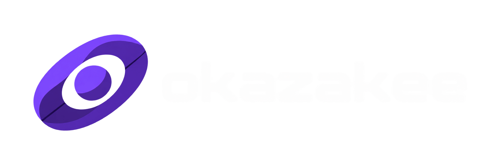

 

### Full-Stack & Mobile Developer · Open Source · Bitcoin ⚡

Building software and taking side projects way further than necessary.

 

## About

I'm a **full-stack and mobile developer**. Most of the time I'm somewhere between web, mobile, Linux, self-hosting, developer tooling and infrastructure.

I tend to build things because I need them, because existing solutions annoy me, or simply because figuring out how something works sounded like a good idea at the time.

That has somehow led to apps, libraries, Linux tooling, P2P experiments, infrastructure, hardware poking and the occasional piece of Rust.

Lately I've been spending more time around **Bitcoin, Lightning and payment infrastructure**, along with local-first software, privacy and systems that give users more control over their stuff.

I automate more than I probably should, run Linux on almost everything, and use AI agents heavily in how I build software.

I also build and maintain open-source projects, self-hosted infrastructure and whatever else happens to become the next rabbit hole.
